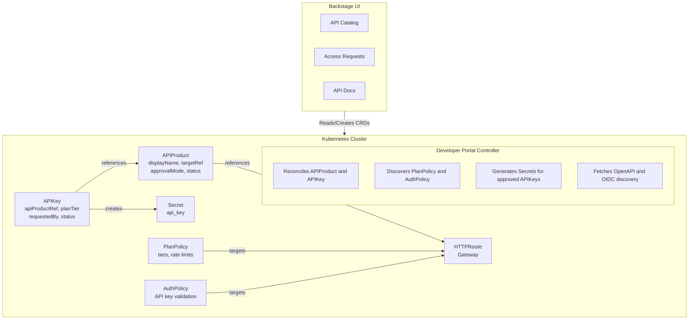

# Developer Portal Overview

The Developer Portal brings self-service API access management to Kubernetes-native organizations. It bridges the gap between API providers who want to share their services and developers who need to consume them, providing a structured workflow for API discovery, access requests, and credential management.

## The Problem: API Access at Scale

Organizations running microservices on Kubernetes face a common challenge: how do you let developers both internal and external discover and consume your APIs safely and efficiently?

Without a structured approach, teams resort to ad-hoc solutions:

- Sharing API keys through Slack messages or wikis
- Manual onboarding processes that don't scale
- No visibility into who is using which APIs
- Inconsistent rate limiting and access controls
- APIs that exist but remain undiscoverable

The Developer Portal addresses this by providing a Kubernetes-native system where APIs are cataloged, access is requested through a formal workflow, and credentials are managed automatically.

## How It Works

The Developer Portal introduces two Custom Resource Definitions (CRDs) that model API products and access requests:

**APIProduct** represents an API offering. It wraps an existing HTTPRoute with the business context needed for consumption: a human-readable name, documentation links, contact information, and access policies. When an API owner creates an APIProduct and sets its `publishStatus` to `Published`, it becomes discoverable in the Backstage developer portal.

**APIKey** represents a developer's request for API access. It captures the requester's identity, their intended use case, and their desired service tier. Depending on the APIProduct's approval mode, the request is either automatically approved or queued for manual review. Upon approval, the controller generates secure credentials stored as Kubernetes Secrets.

This model means that API access follows the same patterns as other Kubernetes resources: declarative, auditable, and managed through standard tooling.

## Developer Portal Personas

The Developer Portal serves four distinct personas, each with different concerns and workflows.

### 1. The API Consumer

API consumers are developers who need to integrate with services provided by other teams. They experience the portal primarily through Backstage, where they can:

- Browse a catalog of available APIs with descriptions, documentation links, and OpenAPI specifications
- See what service tiers are available and their associated rate limits
- View authentication requirements (API keys, JWT/OIDC) and token endpoints
- Request access by creating an APIKey resource (either directly or through a Backstage UI)
- Receive credentials once their request is approved (credentials are shown once and must be saved immediately)

From the consumer's perspective, the value is discoverability and self-service. Rather than searching through wikis or asking colleagues, they find what they need in a single catalog. Rather than waiting for someone to manually provision credentials, they follow a standardized workflow.

### 2. The API Owner

API owners are the teams responsible for specific services. They control how their APIs are presented and accessed:

- Define how the API appears in the catalog through APIProduct metadata
- Choose between automatic and manual approval for access requests
- Review pending access requests and approve or reject them
- Set documentation links so consumers can self-serve

The approval workflow deserves attention. Some APIs are low-risk and can grant automatic access, useful for development environments or internal tooling. Others require human review: verifying the requester's identity, understanding their use case, or ensuring they have appropriate authorization. The `approvalMode` field on APIProduct lets owners make this choice per-API.

### 3. The API Admin

API Admins provide cross-team oversight and governance without being infrastructure-focused platform engineers. They bridge the gap between individual API owners and the platform team:

- View and manage all API Products across the organization, regardless of ownership
- Approve or reject any API key request, enabling centralized governance
- Troubleshoot issues on behalf of API Owners
- Ensure consistency across API Products (naming, documentation standards, etc.)

This role is particularly valuable in larger organizations where individual API owners may be unavailable, or where a central team needs visibility into all API access for compliance or security reasons. Unlike platform engineers, API Admins work within the Developer Portal rather than managing the underlying infrastructure.

### 4. The Platform Engineer

Platform engineers install and configure the Developer Portal infrastructure. Their responsibilities include:

- Deploying the Developer Portal Controller and Backstage plugin
- Creating HTTPRoutes and annotating them for exposure to API owners
- Configuring AuthPolicy resources to enforce API key validation
- Defining PlanPolicy resources that specify rate limit tiers
- Setting up RBAC so appropriate users can create, approve, and manage resources

The platform team doesn't need to be involved in individual API publications or access requests — those are handled by API owners and consumers. Instead, they establish the guardrails and infrastructure that make self-service possible.

## Architecture

The Developer Portal consists of several components working together:

The flow works as follows:

1. **Platform engineers** create HTTPRoutes (standard Gateway API routing) and attach PlanPolicy (rate limits) and AuthPolicy (authentication)
2. **API owners** select an available HTTPRoute and create an APIProduct that adds catalog metadata
3. The **controller** discovers these policies and updates the APIProduct status with available plans
4. **Backstage** reads APIProduct resources and displays them in the catalog
5. **Consumers** browse the catalog and create APIKey resources to request access
6. The **controller** processes APIKey requests, auto-approving or waiting for manual approval based on the APIProduct's configuration
7. Upon approval, the **controller** generates a Secret containing the API key
8. The **consumer** retrieves their key and uses it to authenticate API requests
9. **AuthPolicy** validates incoming requests against the generated Secrets
10. **PlanPolicy** enforces rate limits based on the consumer's selected tier

## Integration with Kuadrant

The Developer Portal is designed as part of the Kuadrant ecosystem. It builds on:

- **Gateway API**: The standard Kubernetes API for traffic routing. APIProduct references HTTPRoute.
- **Kuadrant AuthPolicy**: Enforces authentication at the gateway level. The controller discovers AuthPolicy configurations and surfaces them to consumers, including OIDC token endpoints for JWT-based authentication. For API key authentication, the controller creates Secrets with labels that AuthPolicy (via Authorino) uses for validation.
- **PlanPolicy**: A Kuadrant extension for tiered rate limiting. The controller discovers plan definitions and surfaces them to consumers.

This integration means the Developer Portal doesn't duplicate functionality, it adds the product catalog and access request workflow on top of existing traffic management and policy enforcement.

## Next Steps

- [Getting Started Tutorial](getting-started.md): Set up a complete example with an API product and access request
- [Installation Guide](installation.md): Deploy the Developer Portal Controller to your cluster
