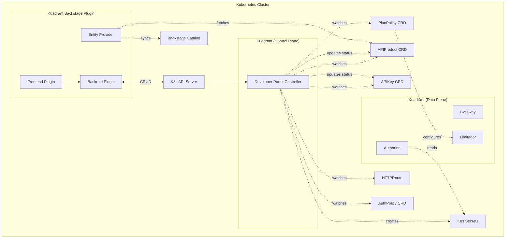
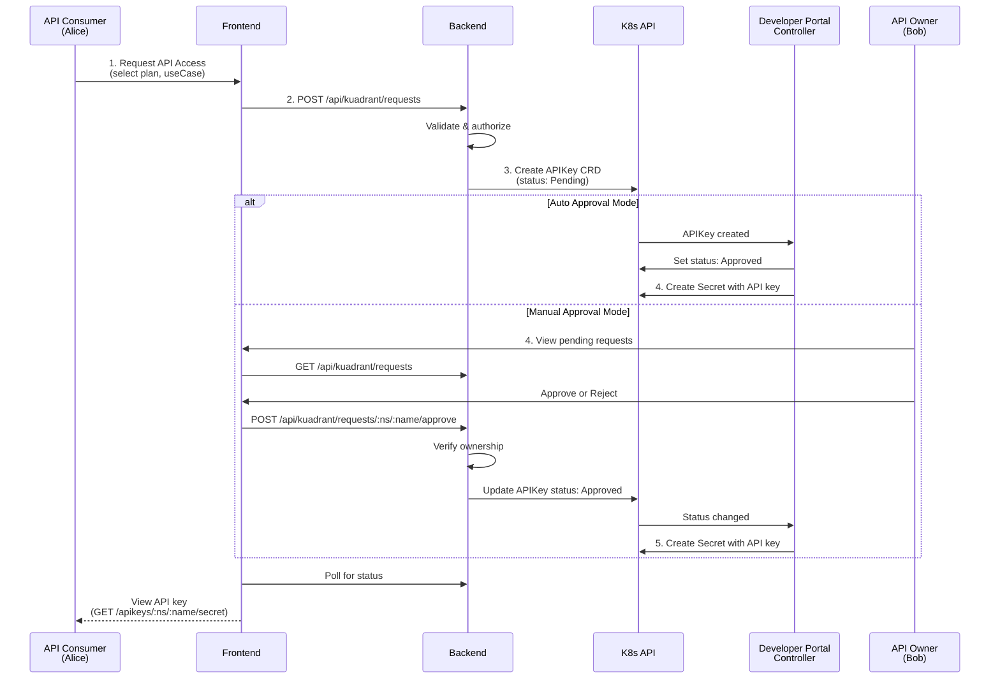
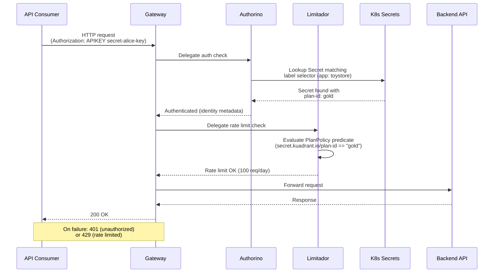
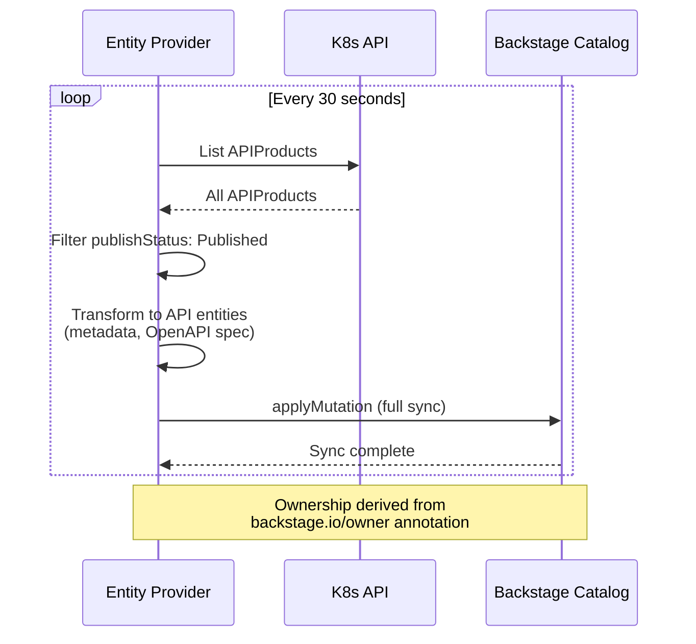

# Plugin Architecture

This document describes the architectural decisions, components, and data flows of the Kuadrant Backstage plugin.

## Overview

The Kuadrant Backstage plugin provides a developer portal interface for API access management. It enables API consumers to discover and request access to APIs, and API owners to manage those requests through approval workflows.

## Component Architecture

### Components

**Backstage Plugin**:
- **Frontend**: React UI for browsing APIs, requesting access, and managing API keys
- **Backend**: Express.js API that validates input (Zod schemas), enforces RBAC permissions, and issues CRUD calls to the Kubernetes API for APIProduct and APIKey resources
- **Entity Provider**: Periodically fetches published APIProducts from Kubernetes and syncs them to the Backstage catalog for discovery

**Kuadrant**:
- **Developer Portal Controller**: Kubernetes operator that reconciles APIKey (approval, Secret lifecycle) and APIProduct (policy discovery, OpenAPI sync, OIDC discovery) resources
- **Gateway**: Istio-based gateway that routes API traffic
- **Authorino**: Kubernetes-native authorization service that validates API keys from label-selected Secrets
- **Limitador**: Rate limiting service that enforces tier-based quotas

**Technologies**:
- Frontend: React, TypeScript, Material-UI
- Backend: Express.js, Zod, @kubernetes/client-node
- Testing: Playwright (E2E), Jest (unit tests)

### Technology Choices

**React + TypeScript + Material-UI:**
- React: Required by Backstage plugin framework
- TypeScript: Type safety for Backstage APIs and component contracts
- Material-UI v4: Backstage's UI library (forced version for consistency with core)

**Express.js:**
- Standard Backstage backend framework
- Lightweight HTTP routing
- Native middleware support for CORS, auth, permissions

**Zod:**
- Runtime schema validation for API requests
- Type inference (generates TypeScript types from schemas)
- Prevents invalid data from reaching Kubernetes API

**Playwright:**
- Browser automation for E2E tests
- Component annotations for test tracking
- Backstage test infrastructure standard

### High-Level Component Diagram

## Data Flow Diagrams

### API Key Request and Approval Flow

### Runtime API Authentication

Once an APIKey is approved and the Secret is created, Kuadrant enforces authentication and rate limiting at runtime:

**Secret Structure** (created by Developer Portal Controller):
- **Labels**: Match AuthPolicy selectors (e.g., `app: toystore`)
- **Annotations**: Plan identification (`secret.kuadrant.io/plan-id: gold`, `secret.kuadrant.io/user-id: user:default/alice`)
- **Data**: Actual API key value

### Catalog Sync Flow

The Entity Provider synchronizes published APIProducts from Kubernetes to the Backstage catalog:

## Security Architecture

The plugin implements defense-in-depth security with multiple layers:

- **Authentication**: All endpoints require valid Backstage credentials
- **Authorization**: RBAC permission checks enforce role-based access (`.all` and `.own` permissions)
- **Input Validation**: Zod schemas validate and sanitize all request data
- **Ownership Verification**: Resources are checked against user ownership before allowing modifications
- **Kubernetes RBAC**: Service account uses minimal permissions with access limited to specific CRDs and namespaces

For detailed security guidelines, see [Backend Security](./backend-security.md).

## References

- [Backend Security](./backend-security.md) - Detailed security tenets and implementation
- [RBAC Permissions](./rbac-permissions.md) - Permission model and role definitions
- [Kuadrant Resources](./kuadrant-resources.md) - CRD schemas and examples
- [Repository Guide](./repository-guide.md) - Monorepo structure, build system, configuration
