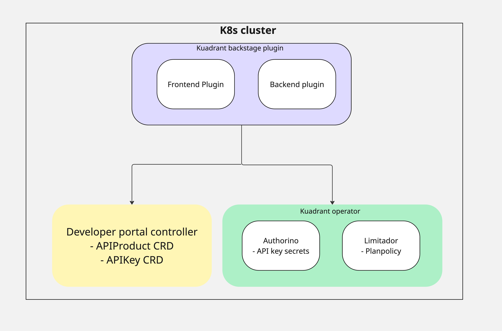

# Plugin Architecture

This document describes the architectural decisions, components, and data flows of the Kuadrant Backstage plugin.

## Component Architecture

### High-Level Component Diagram



### Component Responsibilities

**Backstage Portal**:

- **Frontend**: Developer self-service UI for browsing APIs, requesting access, and managing keys
- **Backend Router**: REST API that performs CRUD operations on Kubernetes resources (APIProducts, APIKeys, PlanPolicies)
- **RBAC Layer**: Enforces role-based permissions for API Consumers, API Owners, and API Admins
- **Entity Provider**: Syncs published APIProducts to the Backstage catalog

**Kubernetes Controllers**:

- **Developer Portal Controller**: Kubernetes controller (external to Backstage) that reconciles APIProduct and APIKey CRDs, creates Secrets, manages approval workflows, and discovers plans from PlanPolicy

**Kuadrant**:

- **Gateway**: Routes API requests and enforces policies
- **Authorino**: Authenticates API requests and validates credentials
- **Limitador**: Enforces rate limits based on plan tiers

### Separation of Concerns

This architecture maintains clean separation between two layers:

- **Backstage**: Manages the developer portal UI and API access provisioning
- **Kubernetes/Kuadrant**: Stores configuration as CRDs, reconciles desired state through controllers, and enforces runtime authentication and rate limiting

Backstage and Kuadrant do not communicate directly. Instead, Kubernetes Secrets serve as the contract between systems, ensuring loose coupling and independent scalability.


## Dependencies

The Kuadrant Backstage plugin requires:

- **Backstage**: Core plugin framework, UI components, and RBAC system
- **Kubernetes Cluster**: API Server (v1.27+) with CRDs for APIProduct, APIKey, PlanPolicy, and HTTPRoute
- **Developer Portal Controller**: External controller that reconciles CRDs and manages Secrets
- **Kuadrant**: Gateway API, Authorino (authentication), and Limitador (rate limiting)

**Technologies Used**:
- Frontend: React, TypeScript, Material-UI
- Backend: Express.js, Zod (validation), Kubernetes client
- Testing: Playwright (E2E), Jest (unit tests)

## Data Flow Diagrams

### API Key Request and Approval Flow

```
┌─────────────┐
│ API Consumer│
│   (Alice)   │
└──────┬──────┘
       │
       │ 1. Request API Access (select plan, useCase)
       ▼
┌─────────────────────────┐
│ Frontend                │
└──────┬──────────────────┘
       │
       │ 2. POST /api/kuadrant/requests
       ▼
┌─────────────────────────┐
│ Backend                 │
│ - Validate & authorize  │
│ - Create APIKey CRD     │
└──────┬──────────────────┘
       │
       │ 3. APIKey created in K8s
       ▼
┌─────────────────────────────────────┐
│ Developer Portal Controller         │
│ - Check APIProduct approval mode    │
└──────┬──────────────────┬───────────┘
       │                  │
  Auto Mode          Manual Mode
       │                  │
       │                  │ Set status: Pending
       │                  ▼
       │            ┌─────────────┐
       │            │ API Owner   │
       │            │  (Bob)      │
       │            └──────┬──────┘
       │                   │
       │                   │ 4. View & approve request
       │                   ▼
       │            ┌─────────────────────────┐
       │            │ Backend                 │
       │            │ - Verify ownership      │
       │            │ - Update APIKey status  │
       │            └──────┬──────────────────┘
       │                   │
       │◄──────────────────┘
       │
       │ 5. Generate API key and create Secret
       ▼
┌─────────────────────────┐
│ Frontend                │
│ - Consumer sees key     │
│ - Can reveal once       │
└─────────────────────────┘
```

### Runtime API Authentication

Once an API key is provisioned, Kuadrant handles runtime authentication:

1. **API Consumer** makes HTTP request with API key in Authorization header
2. **Gateway** forwards request to Authorino for validation
3. **Authorino** validates key against Kubernetes Secrets (created by the Developer Portal Controller)
4. **Limitador** enforces rate limits based on the plan tier
5. **Gateway** forwards valid requests to the backend API or returns 401/429 errors

The Developer Portal Controller creates Secrets with labels (e.g., `app: toystore-api`) and annotations (`user-id`, `plan-id`) that Authorino uses for validation and rate limiting.

### Catalog Sync Flow

The Entity Provider synchronizes published APIProducts from Kubernetes to the Backstage catalog:

1. **APIProductEntityProvider** periodically fetches all APIProducts from Kubernetes
2. Filters for APIProducts with `publishStatus: Published`
3. Transforms each APIProduct into a Backstage API entity with metadata and OpenAPI spec
4. Syncs entities to the Backstage catalog where they appear in the API list

**Ownership**: Entity ownership is derived from the `managed-by-location` annotation URL's `?user=` query parameter (e.g., `user:default/bob`).


## Key Design Decisions

### Why CRDs Instead of ConfigMaps?

The plugin uses Kubernetes Custom Resource Definitions (APIKey, APIProduct, PlanPolicy) rather than ConfigMaps because CRDs provide:

- **Schema validation** via OpenAPI, preventing invalid data
- **Status subresource** to separate desired state (`spec`) from observed state (`status`)
- **Versioning support** (v1alpha1, v1beta1, v1) for schema evolution
- **Fine-grained RBAC** on custom resource types
- **Controller pattern** support with reconciliation loops and event-driven updates
- **OwnerReferences** for automatic garbage collection

ConfigMaps only support unstructured key-value strings without validation, versioning, or status tracking.

## Security Architecture

The plugin implements defense-in-depth security with multiple layers:

- **Authentication**: All endpoints require valid Backstage credentials
- **Authorization**: RBAC permission checks enforce role-based access (`.all` and `.own` permissions)
- **Input Validation**: Zod schemas validate and sanitize all request data
- **Ownership Verification**: Resources are checked against user ownership before allowing modifications
- **Kubernetes RBAC**: Service account uses minimal permissions with access limited to specific CRDs and namespaces

For detailed security guidelines, see [Backend Security](./backend-security.md).

## References

- [Backend Security](./backend-security.md) - Detailed security tenets and implementation
- [RBAC Permissions](./rbac-permissions.md) - Permission model and role definitions
- [Kuadrant Resources](./kuadrant-resources.md) - CRD schemas and examples
- [Repository Guide](./repository-guide.md) - Monorepo structure, build system, configuration
